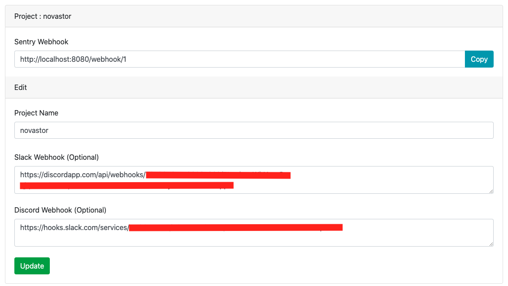

# Sentry Webhook Organizer for Slack and Discord 

This is a basic Flask App that accepts an incoming Sentry webhook and transforms it to the format expected by Discord and Slack.



# Slack
Slack View


# Discord
Discord View


# Setup

````
pip install -r requirements.txt

python app.py
